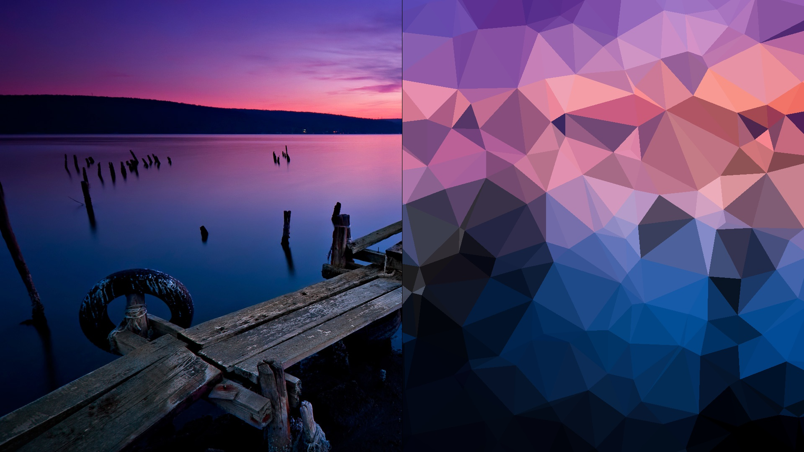
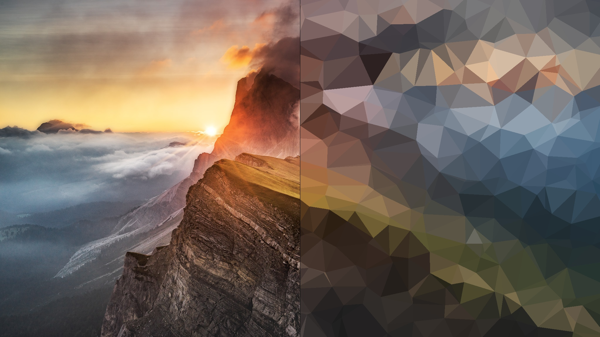

# Low-Poly-Images (First Version)
Repo for an idea I had in mind to create low poly versions of images.

Idea: Create low poly images by creating random polys all over the image and average the pixels of the original image.

1. Get random xy-positions
2. For each position compute the k nearest neighbours to determine the verts of the poly
3. Color the poly according to the average pixel color of the original image (in the area of the poly)

Problems:
Due to random selection of the xy positions it is not guaranteed to fill the new image. In fact, without many repetitions, the image will never be completely filled with the colors of the original image.
Performance is not optimized.

# Low-Poly-Images (Second Version)
Similar to the first approach, but instead of KNN, the Dulaunay method to create polygons is used. Results are much better!  

Image 1

Image 2

Image 3

Image 4 (more triangles)

